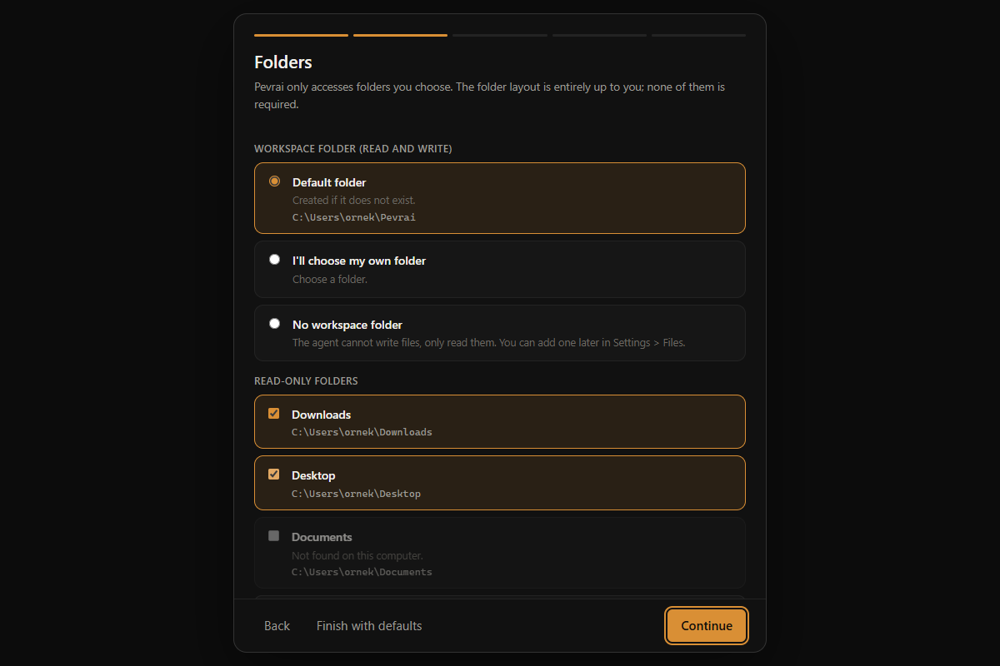
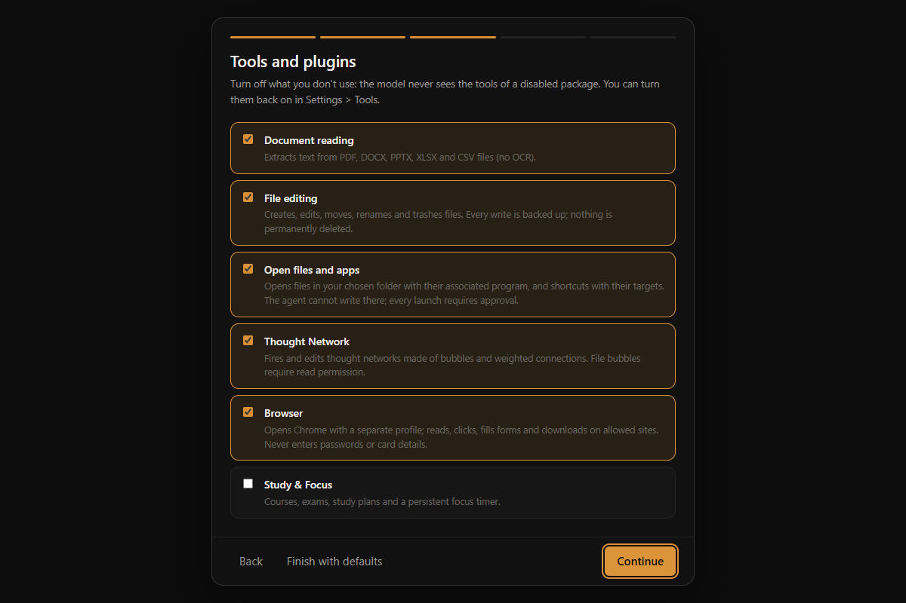

# Pevrai

The name stands for **Personal Evolving Versatile Reasoning Artificial Intelligence**.

**A personal AI assistant that works on your own computer, and asks before it acts.**

You type a task in plain language: *"summarize the PDFs in my Downloads folder"*, *"rename these
photos by date"*, *"research this topic and write a report"*. Pevrai reads your files, uses a
browser and works with documents to get it done. It only touches folders you allow, it asks you
before anything risky, and every file change can be undone. Your chats, settings and backups stay
on your machine; the only thing that leaves it is the text sent to the AI model you choose.


> Türkçe: [docs/README.tr.md](docs/README.tr.md) · Design docs (Turkish): [docs/](docs/)

## What you can do with it

- **Chat and give tasks.** Ask a question, or give a task that needs your files or the web.
  You see each step it takes as it happens.
- **Work with your files.** Read PDFs, Word, PowerPoint, Excel and CSV files, plus images
  and scanned pages via Windows OCR. Write, move, rename and trash files, and convert
  documents (e.g. DOCX → PDF). Every change goes to a journal and can be undone.
- **Use the web.** Pevrai opens Chrome with its own profile and can read, click, fill forms and
  download, but only on sites you allow. It never enters passwords or card details.
- **Run a team of agents.** Hire several AI agents (each can use a different model) and give
  them one task together. You approve how the work is split, and each agent then works in a
  separate, more restricted process. A live **3D office** shows them walking to the desk of the
  work they are doing; you can approve their requests right there.
- **Build a Thought Network.** A 3D map of ideas, rules and files joined by weighted links.
  "Firing" it gathers the right context for a task in a predictable order, with no model calls.
- **Study, notes and projects.** Optional local plugins: focus timer and study plans, searchable
  notes with version history, and project workspaces you can continue in chat.
- **Use any model.** Google Gemini, Anthropic Claude, OpenAI and OpenAI-compatible services
  (DeepSeek, Mistral, Groq, OpenRouter…) or **local models** via Ollama / LM Studio. Chain
  several: when one hits its limit, the task continues on the next.
- **Add tools.** Any [MCP](https://modelcontextprotocol.io) server can be plugged in from the
  Tools panel; its tools stay hidden until you decide how risky each one is.

## First start

On first launch a short setup screen asks for:

1. **Language.** English (default) or Turkish; you can switch any time.
2. **Folders.** A *workspace folder* where the agent may read and write (default `~/Pevrai`;
   pick your own or have none), plus read-only folders such as Downloads and Desktop. No folder
   is mandatory.
3. **Tools and plugins.** Turn off what you don't need. The model never even sees a disabled
   tool.
4. **Appearance.** Theme, and a 3D office or simple cards for the team view.
5. **Model connection.** Add an API key (or a local Ollama server) in Settings › Model.

Every step has a default, so **Finish with defaults** gets you started in one click. Everything
can be changed later in Settings.

<p>
  
  
</p>

## Safety model — what it is and isn't

- **Deny by default.** Every tool call passes through a permission gate (`pevrai/gate.py`)
  before it runs. A tool that isn't classified in `policy.toml` never runs. Risky calls ask
  you first; nothing defaults to "yes".
- **Path jail.** The agent can only read inside your *read roots* and write inside your
  *write roots*. Even inside those, key/password/credential files are blocked.
- **Undoable file tools.** Built-in file writes and bundled converter outputs are journaled
  and backed up; deletion only moves to a trash folder. Undo from the chat or the CLI.
  Other external MCP tools state their undo coverage in the confirmation card.
- **Data is not instructions.** Web pages, documents and MCP output reach the model wrapped
  as untrusted content; the model is told to report, not obey, instructions found there.
- **No shell, no code execution.** Deliberately. It can write a script; it cannot run one.
- **Single user, single machine.** Not a server, not multi-tenant.

## Download

**[⬇ Download Pevrai for Windows](https://github.com/ledaronn/pevrai/releases/latest)**: open the
latest release and run `Pevrai-Setup-<version>.exe` from *Assets*. Windows 10/11, 64-bit; no
Python and no admin rights needed. The installer is not code-signed yet, so Windows may say
*"Windows protected your PC"*: click **More info → Run anyway**. Uninstall from Windows Settings ›
Apps; your settings and chats (`%LOCALAPPDATA%\Pevrai`) are kept. Existing installations
continue to read their previous data folder; renaming does not move or erase personal files.

You also need [Google Chrome](https://www.google.com/chrome/) for the browser tools.

## Run from source (developers)

You need **Python 3.11+** and **Google Chrome**. Clone with git (or *Code › Download ZIP*):

```bash
git clone https://github.com/ledaronn/pevrai.git
cd pevrai
python -m venv .venv
.venv\Scripts\activate
pip install -e .[tam]         # everything; or `pip install -e .` for the minimal set
python -m pevrai              # opens the desktop window and the setup screen
```

After the setup screen, open **Settings › Model** and add one or more API connections. Each connection has a
provider, an optional server address, its own key and an ordered list of models:

| Provider | Examples | Key |
|---|---|---|
| Google Gemini | `gemini-2.5-flash` | Settings, or `GOOGLE_API_KEY` |
| Anthropic Claude (`pip install -e .[anthropic]`) | `claude-sonnet-5` | Settings, or `ANTHROPIC_API_KEY` |
| OpenAI-compatible — OpenAI, DeepSeek, Kimi, Qwen, Mistral, Groq, xAI, OpenRouter, Together | `gpt-4o`, `deepseek-chat` | Settings, or `OPENAI_API_KEY` |
| Local OpenAI-compatible — **Ollama**, LM Studio | `llama3.1:8b` | none |

**Model chain.** Connections are used top to bottom, and each connection's models in the order
you list them. When a model hits its usage limit (HTTP 429, a daily quota, or an exhausted
balance), the running task continues from the same step on the next model in the chain, with
its tool history intact. A model that hit its limit is skipped for a while: about 90 seconds for
per-minute limits, until midnight for daily quotas and balance errors. Settings › Model shows
which models are skipped and lets you reset them. An existing single-provider setup keeps
working unchanged and becomes the first connection the first time you edit the list.

**Model picker and modes.** The model picker next to the mode button on the chat screen lists
every model from Settings › Model. The task starts on the model you pick. **Automatic** starts
at the top of the chain. Modes (Fast, Balanced, Deep, Maximum) never choose a model; they only
set how much work a task may do (step, tool-call and request limits).

Keys are never written to `policy.toml`, the journal or chats. They live in the system keyring
(`pip install -e .[anahtar]`) or in `~/.vekil/credentials.json`, which is on the agent's own
blocklist. Each connection has its own key slot. In `policy.toml` a connection is a
`[baglantilar.<id>]` table (`ad`, `saglayici`, `taban_url`, `modeller`), and `[model] zincir` sets
the order.

First start opens a short **setup screen**: language (English by default), folders, packages
and appearance. Every step has a default, so "Finish with defaults" gets you going in one
click; everything can be changed later in Settings. It also creates your personal files from
the templates:

| Personal file (git-ignored) | Template | What it holds |
|---|---|---|
| `policy.toml` | `policy.example.toml` | read/write roots, allowed sites, tool risk levels, MCP servers, removed packages |
| `config/persona.md` | `config/persona.example.md` | your preferences, sent to the model with every task |
| `config/arayuz.toml` | — | UI settings (language, theme, …) |

**Folders are yours to arrange.** By default the agent reads and writes a *workspace folder*
(`~/Pevrai`) and may read `~/Downloads` and `~/Desktop`. No folder is mandatory: pick another
workspace, add more read or write roots, or have no workspace at all (the agent then cannot
write files). Changing the workspace moves it everywhere it is used (read/write roots, local
file roots, task profiles); the files themselves are never touched. Change folders in
**Settings › Files**, allowed sites in **Settings › Browser**, and capability packages in
**Tools**. Nothing personal is committed.

CLI:

```bash
python -m pevrai.vekil_v0 "list my workspace folder"        # one task
python -m pevrai.vekil_v0 "question" --profil sohbet         # chat only, no tools
python -m pevrai.vekil_v0 --gecmis                           # undoable actions
python -m pevrai.vekil_v0 --geri-al [file]                   # undo
python tests/evals.py                                        # gate + code tests (no model calls)
python tests/dusmanca_testi.py                               # adversarial suite (no model calls)
```

## Tools and packages

Capabilities come in **packages**, shown in the Tools panel with plain-language names:

| Package | Tools | Removable |
|---|---|---|
| Core reading | list folder, read file, search, change history | no — per-chat off only |
| Document reading | PDF/DOCX/PPTX/XLSX/CSV text; images and scanned PDF pages via Windows OCR (`[ocr]` extra) | yes |
| File editing | write, edit in place, new folder, move, rename, trash | yes |
| Open files & apps | opens items from **one folder you choose** (documents with their app, shortcuts with their target, programs); the agent cannot write to that folder; every launch asks | yes |
| Browser | open, read, inspect, click, fill, download (allow-listed sites) | yes |
| Team (left rail **Team**, or `/ekip`) | a live **3D office**: agents walk to the desk of the work they are really doing (code, files, library, meeting table), hire agents on your API connections, give the team or a single agent a task, replay past runs; falls back to cards without WebGL. Also **projects** (workspace folders), **agents** (own connection/model each), **history**. Agents split one task by **disjoint paths** in the same workspace; one approval for the split; each worker is a separate process with a narrowed policy; workers talk on a **board** the user can also write to; an integrator merges — [docs/EKIP.md](docs/EKIP.md) | define agents to enable |
| Thought Network (left rail **Network**, `ag_*`) | a 3D canvas of bubbles holding ideas, rules and files; weighted, delayed connections with logic gates (or/and/at-least/xor/none). Firing spreads a signal like an action potential — the bubbles light up in order and the nodes come back **in the order the network's logic produces**: a deterministic context compiler, no model calls. The agent can **build its own** network (`ag_kur`, with `ag_kilavuz` teaching the language) but cannot rewrite yours; what it writes is marked and wrapped until you adopt it. File bubbles go through the ordinary read permission — [docs/AG.md](docs/AG.md) | yes |
| Any MCP server | discovered on connect | add / delete |

Removing a package writes `[paketler] kaldirilan` to `policy.toml`: the gate rejects those
tools, their schemas are never sent to the model, and the system prompt stops mentioning them.
Adding an MCP server is one line (`[mcp.<name>] komut = [...]`) or a form in the Tools panel;
its tools stay hidden until you classify each one with a risk level. See
[docs/TOOLS.md](docs/TOOLS.md).

## Study, notes and project workspaces

Open **✦ → Çalışma alanın** to enable **Study & Focus**, **Smart Notes** and
**Workspace** independently. They provide local SQLite storage, persistent focus
timers, searchable notes with revision history, and project tasks/files/continuation
context. Their panels work without model calls; AI tools use the existing permission
gate. See [setup, tool reference and examples](docs/PRODUCTIVITY.md).

## Requirements

- Windows 10/11 (first release is Windows-only: WebView2, Chrome via CDP, Explorer integration)
- Python 3.11+
- Google Chrome (for browser tools; Pevrai launches it with its own profile)
- LibreOffice (optional, for the converter's DOCX/PPTX → PDF)

Optional extras: `pip install -e .[belge]` (document readers), `.[ocr]` (Windows built-in OCR for images and scanned PDFs; no model download, language packs come from Windows), `.[tarayici]` (Playwright),
`.[donusturucu-gui]` (standalone converter window), `.[dev]` (tests).

## Layout

```
pevrai/            the package: agent loop, gate, journal, browser, MCP bridge, UI
  arayuz/          single-file HTML/JS UI (Turkish source strings + English dictionary)
Donusturucu/       document converter — MCP server + standalone GUI
config/            templates for personal config
docs/              design docs (Turkish): architecture, security, tools, UI, roadmap
evals/             regression tasks; ornek/ holds their sample files (copied into the workspace)
tests/             test suites (no model calls except evals.py --hepsi)
policy.example.toml
```

## Roadmap (short)

1. A code-signed installer (no SmartScreen warning).
2. A smaller default token footprint per call (conditional tool schemas by task).
3. Running the offline evals in English mode as well (they are pinned to the source language).

Full roadmap and decision log: [docs/ROADMAP.md](docs/ROADMAP.md), [docs/DEVIR.md](docs/DEVIR.md).

Existing installations: [name change and preserved settings](docs/AD_DEGISIKLIGI.md).

The desktop app checks GitHub for a newer stable release in the background, at most
once every 24 hours. Disable **Settings → General → Check for updates** to stop these
requests. The check sends no documents, conversations or API keys. Its dismissible
notice opens the Releases page; downloads and installation remain manual.

## Language of the source

Identifiers, comments, docstrings and design docs are **Turkish** — a deliberate
convention, not an oversight. Everything a user or the model sees (UI, approval
cards, errors, summaries, system instruction, tool descriptions, tool output)
follows the language setting and ships in English and Turkish
(`pevrai/ceviri.py`, `CEVIRI.en` in the UI). Contributions in English are
welcome; keep existing names as they are.

## License

MIT — see [LICENSE](LICENSE). Third-party notices (Lucide icons): [NOTICE](NOTICE).
The logo is an original design by the author.
