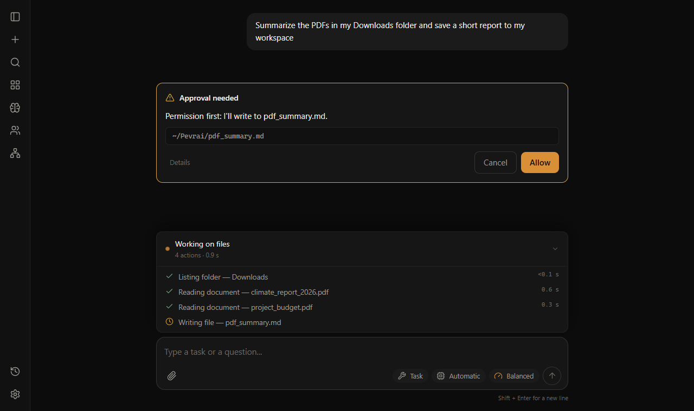

# Pevrai

Adı **Personal Evolving Versatile Reasoning Artificial Intelligence** ifadesinden
türetilmiştir. [Ad geçişi ve mevcut verilerin korunması](AD_DEGISIKLIGI.md).

**Kendi bilgisayarında çalışan ve iş yapmadan önce soran kişisel bir yapay zekâ asistanı.**

Ona sade bir dille bir iş verirsin: *"İndirilenler'deki PDF'leri özetle"*, *"şu fotoğrafları
tarihe göre adlandır"*, *"bu konuyu araştırıp rapor yaz"*. Pevrai dosyalarını okur, tarayıcıyı
ve belgeleri kullanarak işi yapar. Yalnızca izin verdiğin klasörlere dokunur, riskli her adımda
sana sorar ve yaptığı her dosya değişikliği geri alınabilir. Sohbetlerin, ayarların ve yedeklerin
bilgisayarında kalır. Model çağrıları seçtiğin servise, web istekleri izin verdiğin sitelere gider.
İsteğe bağlı sürüm denetimi GitHub'a yalnızca sürüm sorgusu gönderir; kişisel veri eklemez.



## Neler yapabilirsin

- **Sohbet et, görev ver.** Soru sor ya da dosya veya web gerektiren bir iş ver. Attığı her
  adımı canlı görürsün.
- **Dosyalarınla çalış.** PDF, Word, PowerPoint, Excel ve CSV okur; görselleri ve taranmış
  sayfaları Windows OCR ile okur. Dosya yazar, taşır, adlandırır, çöpe atar ve belge dönüştürür
  (ör. DOCX → PDF). Her değişiklik günlüğe yazılır ve geri alınabilir.
- **Web'i kullan.** Chrome'u kendi profiliyle açar. Yalnızca izin verdiğin sitelerde okur, tıklar,
  form doldurur ve indirir. Parola ya da kart bilgisi girmez.
- **Ajan ekibi kur.** Birden çok yapay zekâ ajanı işe alırsın (her biri farklı modeli
  kullanabilir) ve onlara birlikte tek bir görev verirsin. İşin nasıl bölüneceğini sen
  onaylarsın; ardından her ajan ayrı ve daha kısıtlı bir süreçte çalışır. Canlı **3B ofiste**
  ajanlar yaptıkları işin masasına yürür; isteklerini de orada onaylarsın.
  Ajan kartındaki **Düzenle** ile bağlantısını, modelini, rengini ve görünümünü değiştirebilirsin;
  aynı form Ekip > Ajanlar'da da bulunur.
- **Düşünce Ağı kur.** Fikirleri, kuralları ve dosyaları ağırlıklı bağlantılarla birleştiren
  3B bir harita. Ağı "ateşlemek", bir görev için gereken bağlamı model çağırmadan, öngörülebilir
  bir sırayla toplar.
- **Ders, not ve projeler.** İsteğe bağlı yerel eklentiler: odak sayacı ve çalışma planları,
  sürüm geçmişli aranabilir notlar, sohbette devam ettirilebilen proje alanları.
- **İstediğin modeli kullan.** Google Gemini, Anthropic Claude, OpenAI ve uyumlu servisler
  (DeepSeek, Mistral, Groq, OpenRouter…) ya da Ollama / LM Studio ile **yerel modeller**. Birden
  çoğunu zincirleyebilirsin: biri limite takılınca görev sıradakiyle sürer.

## İlk açılış

**Ayarlar → Genel → Güncellemeleri denetle**, açılışta arka planda en fazla 24 saatte
bir yeni kararlı sürüm arar. Kapatırsan istek göndermez. Yeni sürüm bildirimi kapatılabilir;
**İndir** GitHub Releases sayfasını açar. Dosyaların ve sohbetlerin bu sorguya eklenmez.

İlk açılışta kısa bir kurulum ekranı gelir:

1. **Dil.** İngilizce (varsayılan) ya da Türkçe; istediğin zaman değiştirebilirsin.
2. **Klasörler.** Ajanın okuyup yazabileceği bir *çalışma klasörü* (varsayılan `~/Pevrai`; kendi
   klasörünü seçebilir ya da hiç seçmeyebilirsin) ve yalnızca okuyacağı klasörler (İndirilenler,
   Masaüstü…). Hiçbir klasör zorunlu değil.
3. **Araçlar ve eklentiler.** Kullanmadıklarını kapatırsın; kapalı aracı model hiç görmez.
4. **Görünüm.** Tema; ekip görünümü için 3B ofis ya da sade kartlar.
5. **Model bağlantısı.** Ayarlar › Model'den bir API anahtarı (ya da yerel Ollama) eklenir.

Her adımın bir varsayılanı var: **Varsayılanlarla bitir** tek tıkla başlatır. Hepsi sonra
Ayarlar'dan değiştirilebilir.

**İndir (Windows):** [Son sürümü aç](https://github.com/ledaronn/pevrai/releases/latest) ve
*Assets* altındaki `Pevrai-Setup-<sürüm>.exe` dosyasını çalıştır. Python ya da yönetici izni
gerekmez. Windows "Bilgisayarınız korundu" derse **Ek bilgi → Yine de çalıştır** (kurulum programı
henüz imzalı değil). Tarayıcı araçları için Google Chrome gerekir.

**Kaynaktan çalıştırma (geliştiriciler):** Python 3.11+ ve Google Chrome gerekir. Projeyi indirip
aç, ardından:

```bash
python -m venv .venv
.venv\Scripts\activate
pip install -e .[tam]
python -m pevrai
```

---

Aşağısı projenin teknik özeti.

Yerelde çalışan, araç çağırabilen kişisel bir ajan. Bir LLM API'sini akıl yürütme motoru
olarak kullanır; dosya sistemi, tarayıcı ve MCP araçlarını tek bir denetimli döngü
üzerinden kontrol eder.

> Paket adı `pevrai`.

**Kabuk erişimi yoktur ve olmayacaktır.** Genel bir komut çalıştırıcı (`shell.run`),
kabuk erişimi ve model tarafından üretilmiş kodun çalıştırılması Faz 7'de yazılı
olarak reddedildi — gerekçe: `DEVIR.md` §14. Kapı "bu programı çalıştırabilir misin"
diye bakabilir, "bu program çalışınca ne yapacak" diye bakamaz.

## Ne değildir

Kapsamı baştan daraltmak, projenin bitmesinin tek şartı:

- Kendi temel modelini eğitmez. Model dışarıdan, API ile gelir.
- Tam otonom değildir. Riskli her adımda kullanıcıya sorar. Hedef "denetimli ajan".
- Genel amaçlı bir asistan olmaya çalışmaz. Sadece kullanıcının tekrar eden işlerini yapar.
- Çok kullanıcılı, sunucuya kurulan bir servis değildir. Tek makine, tek kullanıcı.
- Kod çalıştırmaz. Kod yazabilir (`write_file` keyfi metin yazar), ama çalıştıran
  hiçbir araç yoktur ve eklenmeyecektir.
- Talimatı yalnızca kullanıcıdan alır. Web sayfası, PDF, araç çıktısı, araç hata
  mesajı, durum dosyası, MCP dönüşü — hiçbiri talimat kaynağı değildir; hepsi
  `<untrusted_content>` içinde veri olarak gelir (bkz. [SECURITY.md](SECURITY.md)).

## Temel tasarım kararları

| Karar | Gerekçe |
|---|---|
| Araçlar MCP sunucusu olarak yazılır | Araçlar uygulamaya gömülü kalmaz; Pevrai, Claude Desktop, Cursor aynı aracı kullanır |
| Önce CLI, GUI en sonda | GUI, hatalı bir çekirdeği gizler ve geliştirmeyi yavaşlatır |
| Hatalar modele metin olarak döner | Model kendi kendini düzeltebilsin; hata yutulursa ajan değil script olur |
| Otomasyon sırası: API > CLI > tarayıcı > fare/klavye | Piksel ve koordinat en kırılgan katman, son çare |
| Varsayılan reddet (deny by default) | Yeni araç eklendiğinde otomatik yetki kazanmaz, açıkça izin verilir |
| Vektör DB yok (şimdilik) | Erken karmaşıklık. Düz dosya + tam metin arama uzun süre yeter |
| Arayüzde HTML dizesi üretilmez | Araç çıktısı sayfa metni olabilir; ayrıştırılmayan metin enjekte edilemez |

## Mimari özet

```
                    ┌──────────────┐
   kullanıcı  ──►   │  Orkestratör │  ◄── ajan döngüsü, adım limiti, log
                    └──────┬───────┘
                           │
           ┌───────────────┼────────────────┐
           ▼               ▼                ▼
    ┌────────────┐  ┌─────────────┐  ┌────────────┐
    │ Model      │  │ İzin        │  │ Bağlam     │
    │ İstemcisi  │  │ Kapısı      │  │ Yöneticisi │
    └────────────┘  └──────┬──────┘  └────────────┘
                           │  (onaylanan çağrı)
                           ▼
                    ┌─────────────┐
                    │ Araç Yürütücü│
                    └──────┬──────┘
                           │
        ┌──────────┬───────┴───────┬──────────────┐
        ▼          ▼               ▼              ▼
   dosya/kabuk  tarayıcı      dönüştürücü    (MCP sunucuları)
```

Detay: [ARCHITECTURE.md](ARCHITECTURE.md)

## Dizin yapısı

Kod `pevrai/` paketinde; kullanıcının ellediği şeyler (policy.toml, config/) depo
kökünde. **Kişisel dosyalar depoya girmez**: `policy.toml`, `config/persona.md` ve
`config/arayuz.toml` `.gitignore`'da, ilk açılışta şablonlarından üretilir
(`pevrai/kurulum.py`).

```
.
├─ README.md               # İngilizce giriş (GitHub)
├─ LICENSE                 # MIT
├─ pyproject.toml          # paket, ekstralar (belge/ocr/tarayici/donusturucu/dev), giriş noktaları
├─ requirements.txt        # tam kurulum (= pip install -e .[tam])
├─ policy.example.toml     # izin politikası ŞABLONU ({PROJE}, {EV} yer tutucuları)
├─ policy.toml             # KİŞİSEL, depoya girmez: kökler, siteler, araç riskleri, MCP, kaldırılan paketler
├─ pevrai/
│  ├─ vekil_v0.py          # ajan döngüsü (calistir / devam_et), MCP tembel bağlantısı; eski adlar geriye dönük uyumlu
│  ├─ talimat.py           # sistem talimatı: her görevde veriden kurulur (kökler, gösterilen araçlar, persona)
│  ├─ durum.py             # gözetimsiz görev durum dosyası, devam görevi, dönüş özeti
│  ├─ cli.py               # komut satırı (pevrai-cli): görev, --devam, --gecmis, --geri-al, site yönetimi
│  ├─ araclar/             # @arac kayıt defteri (kayit.py) + dosya.py, tarayici_araclari.py, ortak.py
│  ├─ baglam.py            # çalışma zamanı tekilleri (politika, tarayıcı, MCP köprüsü)
│  ├─ gate.py              # izin kapısı: yol/uzantı/site doğrulama, risk seviyeleri, tavanlar, kaldırılan paketler
│  ├─ paketler.py          # araç paketleri: çekirdek/belge/dosya düzenleme/tarayıcı + MCP; insan dilinde adlar
│  ├─ kurulum.py           # ilk açılış: policy.toml ve persona.md şablondan
│  ├─ model/               # sağlayıcı katmanı: taban biçimi + gemini / openai_uyumlu / anthropic_ adaptörleri
│  ├─ anahtar.py           # API anahtarı: Ayarlar'dan kaydedilen (keyring > credentials.json) > ortam değişkeni
│  ├─ eklentiler/          # yerel eklentiler (study / notes / workspace): SQLite, servis, araç şeması
│  ├─ journal.py           # JSONL günlük, yedek/geri alma, çöp, günlük kota sayacı
│  ├─ ayarlar.py           # policy.toml/arayuz.toml'u panelden güvenli düzenler (yedek + doğrula + geri yükle)
│  ├─ sohbet.py            # sohbet geçmişinin diske kaydı
│  ├─ belge.py             # PDF/DOCX/PPTX/XLSX -> düz metin; görüntü/taranmış sayfa -> ocr.py
│  ├─ ocr.py               # Windows yerleşik OCR (ekran görüntüsü, fotoğraf, taranmış PDF)
│  ├─ ekip.py              # çoklu ajan: plan → tek onay → ayrı süreçte işçiler (dar politika) → birleştirici
│  ├─ ara.py               # dosya adı + içerik arama (kara liste uygulanır)
│  ├─ tarayici.py          # Playwright/CDP: kendi Chrome profili, sahiplik doğrulaması
│  ├─ mcp_bridge.py        # harici MCP sunucularını araç kaydına bağlar, çıktıyı kırpıp sarmalar
│  ├─ olaylar.py           # olay tipleri, Oturum, onay sözleşmesi
│  ├─ gui_kopru.py         # ajan thread'i <-> UI thread'i köprüsü
│  ├─ pencere.py           # pywebview penceresi, JS'e açılan Api (pevrai)
│  ├─ modeller.py          # policy.toml'daki model adları hâlâ geçerli mi
│  ├─ kisayol.py           # masaüstü kısayolu
│  └─ arayuz/index.html    # tek dosya HTML/CSS/JS arayüz (kaynak dil Türkçe + İngilizce sözlük)
├─ config/
│  ├─ persona.example.md   # kişisel tercih şablonu -> persona.md (depoya girmez)
│  └─ komutlar.toml        # arayüzdeki slash komutları
├─ Donusturucu/            # dosya dönüştürücü: MCP sunucusu (server.py) + bağımsız GUI (app_gui.py)
├─ docs/                   # bu belgeler (Türkçe); tarihce/ altında faz devir notları
├─ evals/tasks.yaml        # regresyon görevleri ({KUM} = çalışma klasörü, {EV} yer tutucularıyla)
├─ evals/ornek/            # ajan testlerinin örnek dosyaları (tuzak.html...), çalışma klasörüne kopyalanır
├─ tests/                  # modelsiz test paketleri (evals.py --hepsi ajan testlerini de koşar)
└─ Araclar/                # depoya girmeyen, bağımsız MCP sunucuları (kendi .venv'leri)
```

## Başlarken

```bash
python -m venv .venv
.venv\Scripts\activate            # Windows; Unix'te: source .venv/bin/activate
pip install -e .[tam]             # ya da: pip install -r requirements.txt
set GOOGLE_API_KEY=...            # ya da Ayarlar > Model'den anahtar gir (Gemini / OpenAI-uyumlu / Anthropic)
python -m pevrai                  # ilk açılış: kurulum ekranı (dil, klasörler, paketler) + şablonlar
python -m pevrai.vekil_v0 "calisma klasorumu listele"
```

Diğer komutlar:

```bash
python -m pevrai.vekil_v0 "gorev" --mod derin     # efor modu: hizli|dengeli|derin|azami
python -m pevrai.vekil_v0 "gorev" --profil <ad>   # gorev profili: onceden imzali onay, daraltilmis kapsam
python -m pevrai.vekil_v0 "soru"  --profil sohbet # saf sohbet: hic arac yok (girdi token ~%86 az)
python -m pevrai.vekil_v0 --devam <kimlik>        # bir tavana carpip yarim kalan gorevi kaldigi yerden surdur
# Profil azami_devam tasiyorsa gorev tavana carpinca KENDILIGINDEN devam eder
# (profilsiz yolda ETMEZ: durum yazilir, devam kararini kullanici verir).
python -m pevrai.vekil_v0 --gecmis            # geri alinabilecek islemleri listele
python -m pevrai.vekil_v0 --geri-al [dosya]   # son islemi (ya da belirtilen dosyayi) geri al
python -m pevrai.vekil_v0 --siteler           # tarayicinin acabilecegi siteleri listele
python -m pevrai.vekil_v0 --site-ekle <alan>
python -m pevrai.vekil_v0 --site-sil <alan>
python tests/dusmanca_testi.py               # dusmanca test paketi: savunmalari kirma denemeleri (model cagirmaz)
python tests/evals.py                        # kapi + kod testleri (model cagirmaz)
python tests/evals.py --hepsi                # + ajan testleri (kota harcar)
python -m pevrai                      # grafik arayuz (pywebview gerekir)
python -m pevrai.kisayol              # masaustune Pevrai.lnk (calistiran Python'un pythonw'u, konsolsuz, ikonlu)
python tests/kopru_testi.py                  # thread + onay + durdurma + sohbet kalicilik testleri
python tests/ayarlar_testi.py                # ayarlar paneli + saf karar fonksiyonlari (model cagirmaz)
python tests/arayuz_testi.py                 # arayuz guvenlik ve yerlesim denetimi
python tests/tarayici_testi.py               # tarayici baglanti/kacis/parola/indirme testleri (Playwright'siz)
python tests/eylem_testi.py                  # tarayici eylem izinleri (site profilleri)
python tests/sohbet_testi.py                 # sohbet kalicilik testleri
```

## Belgeler

- [ROADMAP.md](ROADMAP.md) — fazlar, çıktılar, kabul kriterleri
- [ARCHITECTURE.md](ARCHITECTURE.md) — döngü, bileşenler, veri akışı
- [TOOLS.md](TOOLS.md) — araç kataloğu ve yazım sözleşmesi
- [SECURITY.md](SECURITY.md) — izin modeli ve tehdit değerlendirmesi
- [DEVIR.md](DEVIR.md) — oturum devri; §14 reddedilen fikirler, §15 öğrenilen dersler

Gözetimsiz bir görev bittiğinde `~/.vekil/ozet/<kimlik>.md` altında tek sayfalık
bir **dönüş özeti** bırakılır (model yazmaz; olgular `journal` ve kota
sayaçlarından gelir). Arayüzde görev bitince tek kart olarak belirir.
- [tarihce/DEVIR_FAZ6.md](tarihce/DEVIR_FAZ6.md), [tarihce/DEVIR_FAZ7.md](tarihce/DEVIR_FAZ7.md)
  — faz kapanışları, ölçümler, karar gerekçeleri. Bir kararın "neden böyle" sorusu önce burada aranır.
